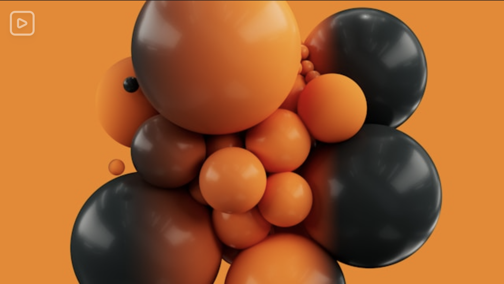
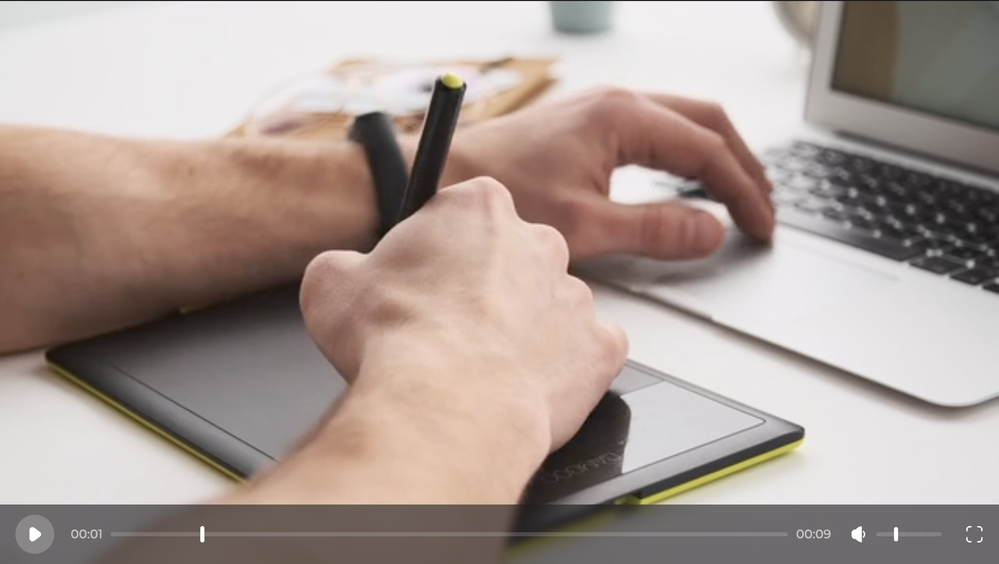

# **React Video Player**

A custom video player built using **React**, **Vite**, **Ionic**, and **TailwindCSS**, designed to function without relying on third-party libraries. This lightweight and flexible solution emphasizes a modern tech stack for crafting custom multimedia experiences.




## 🛠 **Features**

- Built with **React**, **Vite**, and **TypeScript**.
- Styling powered by **TailwindCSS** for rapid UI development.
- Cross-platform capabilities using **Ionic** framework.
- **Zero dependency** on third-party video libraries.
- Video playback support for **common formats** (e.g., MP4, WebM).
- **Play**, **pause**, and seek **controls**.
- **Volume** adjustment and **mute/unmute** options.
- **Fullscreen** toggle.
- **Encrypt** video source
- Support .m3u8 format using **ffmpeg**

## 💻 **Tech Stack**

- **React**: Component-based UI framework.
- **Vite**: Fast build tool for modern web projects.
- **Ionic**: Framework for cross-platform mobile/web apps.
- **TailwindCSS**: Utility-first CSS framework.
- **TypeScript**: Static type checking for JavaScript.

## 🚀 **Run Locally**

Clone the project

```bash
  git clone https://link-to-project
```

Go to the project directory

```bash
  cd my-project
```

Install dependencies

```bash
  npm install
```

Start the server

```bash
  ionic serve
```

## ✅ **Running Tests**

To run tests, run the following command

```bash
  npm run test
```

## 👩 **About Me**

Seasoned front-end developer with over eight years of experience specializing in pharmacy-focused solutions. Proven expertise in building scalable systems that enhance patient care and streamline pharmacy management. Delivering impactful software solutions with measurable outcomes, such as improving operational efficiency, reducing errors, and elevating user satisfaction.

[](https://lunanezha.com/)
[](www.linkedin.com/in/luna-nezha/)

## 💡 **Support**

For support, email mahdie.nezhadhosseini@gmail.com.

## 🤝 **Contributing**

Contributions are always welcome!

## 📝 **License**

This project is licensed under the
[MIT](https://choosealicense.com/licenses/mit/) License. See the LICENSE file for details.
